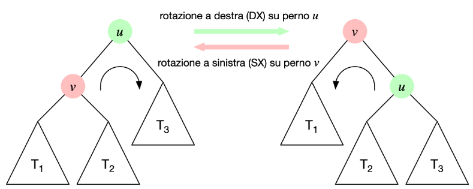
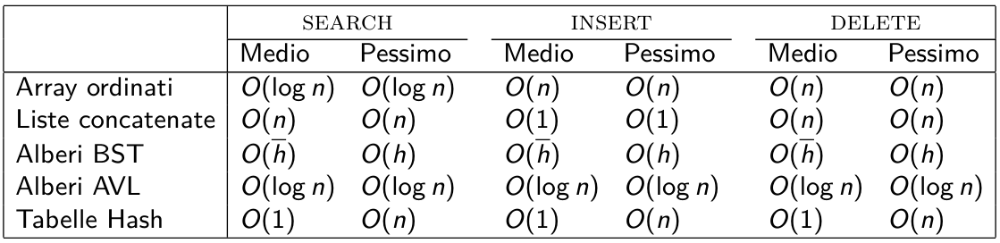
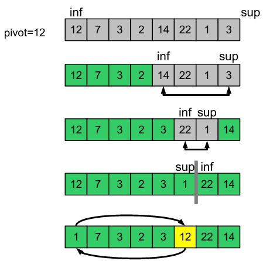

# Notazione asintotica

## Definizione (O-grande)
Data una funzione di costo $g(n)$ definiamo l'insieme di funzioni che rappresentano un **limite asintotico superiore** per $g(n)$ come
$$ O(g(n)) = \{ f(n) \mid \exists c > 0, n_0 \geq 0 \text{ t.c. } \forall n \geq n_0, f(n) \leq cg(n) \} $$

## Definizione ($\Omega$-grande)
Data una funzione di costo $g(n)$ definiamo l'insieme di funzioni che rappresentano un **limite asintotico inferiore** per $g(n)$ come
$$ \Omega(g(n)) = \{ f(n) \mid \exists c > 0, n_0 \geq 0 \text{ t.c. } \forall n \geq n_0, f(n) \geq cg(n) \} $$

## Definizione ($\Theta$)
Data una funzione di costo $g(n)$ definiamo l'insieme di funzioni **asintoticamente equivalenti** a $g(n)$ come
$$ \Theta(g(n)) = \{ f(n) \mid \exists c_1, c_2 > 0, n_0 \geq 0 \text{ t.c. } \forall n \geq n_0, c_1 g(n) \leq f(n) \leq c_2 g(n) \} $$

## Teorema
$$ f(n) = \Theta(g(n)) \iff f(n) = O(g(n)) \land f(n) = \Omega (g(n))$$

## Definizione (o-piccolo)
Data una funzione di costo $g(n)$ definiamo l'insieme di funzioni che sono **domiante asintoticamente** da $g(n)$ come
$$ o(g(n)) = \{ f(n) \mid \forall c > 0, \exists n_0 \geq 0 \text{ t.c. } \forall n \geq n_0, f(n) < cg(n) \} $$

## Definizione ($\omega$-piccolo)
Data una funzione di costo $g(n)$ definiamo l'insieme di funzioni che **dominano asintoticamente** $g(n)$ come
$$ \omega(g(n)) = \{ f(n) \mid \forall c > 0, \exists n_0 \geq 0 \text{ t.c. } \forall n \geq n_0, f(n) > cg(n) \} $$

## Analisi ammortizzata
Differisce dal costo medio perchè **calcola la media del costo di una sequenza di operazioni**

### Metodo dell'aggregazione
Determiniamo un limite superiore al costo totale di una sequenza di $n$ operazioni e dividiamo per $n$

### Esempio
        INSERIRE ESEMPIO
---

### Metodo degli accantonamenti
- Assegnamo un _costo ammortizzato_ ad ogni operazione
- Ogni operazione viene addebitata con il suo costo ammortizzato
- Salviamo come _credito_ la differenza tra il suo costo ammortizzato e il costo reale
- Se il costo reale è più alto, usiamo il credito
- Il costo ammortizzato è corretto se il **credito non è mai negativo**

### Esempio
        INSERIRE ESEMPIO


# Equazioni di ricorrenza

## Metodo dell'iterazione
Aproccio di tipo bruteforce, iteriamo fino a che non vediamo un pattern per il passo $i$ e da lì calcoliamo il costo in base a quando termina

### Esempio
        INSERIRE ESEMPIO
---

## Metodo della sostituzione
Usato per _validare_ un'ipotesi
- Ipotizziamo una soluzione
- Usiamo al definizione di $O, \Omega, \Theta$ per verificarla induttivamente

### Esempio
        INSERIRE ESEMPIO
---

## Metodo dell'albero di ricorsione
È la versione su albero del metodo iterativo
- Generiamo l'albero di ricorsione dall'equzione di ricorrenza
- Calcoliamo il numero di nodi ad ogni livello dell'albero
- Identifichiamo qualche schema ricorrente legato al livello dell'albero

### Esempio
        INSERIRE ESEMPIO
---

## Master Theorem
Risolve equazioni di ricorrenza nella forma

$$ T(n) = aT(n/b) + f(n) \qquad \text{con }a \geq 1, b > 1 \text{ costanti e } f(n) \text{ asintoticamente positiva} $$

Si consideri la seguente equazione di ricorrenza

$$ f(n) = \begin{cases}
        d                       & \text{if } n\text{ is even} \\ 
        aT(n/b) + cn^\beta      & \text{if } n\text{ is odd} 
\end{cases} $$

dove $a \geq 1$, $b > 1$ e $c$, $d$ costanti. Sia $\alpha = \log_b{a} = \frac{\log_k{a}}{\log_k{b}}$. Allora

- Se $\alpha > \beta$ allora $T(n) = \Theta(n^\alpha)$
- Se $\alpha = \beta$ allora $T(n) = \Theta(n^\alpha \log{n})$
- Se $\alpha < \beta$ allora $T(n) = \Theta(n^\beta)$

### Esempio
        INSERIRE ESEMPIO

# Strutture Dati Elementari
Definisce _come_ i dati sono logicamente organizzati e le _operazioni_ per accedervi e modificarli, ma _non quali_ dati sono memorizzati

## Dizionario
- Contiene un insieme di *chiavi* univoche
- Ogni chiave è associata ad un *valore*
- I valori possono essere duplicati, le **chiavi** sono **uniche**

Operazioni base:
- `Search(Key k)`: Cerca l'oggetto associato alla chiave $k$
- `Insert(Key k, Data d)`: Aggiunge la coppia $(k, d)$ al Dizionario
- `Delete(Key k)`: Elimina la coppia $(k, d)$ dal Dizionario

## Dizionario su Array Ordinato
Idea: usiamo un array per salvare le coppie *(Key, Data)* e lo manteniamo ordinato rispetto a *Key*

- `Search(Key k)`: Cerca la chiave $k$ con ricerca binaria
  - Ricerca binaria su array ordinato
  - Costo: $O(\log{n})$
- `Insert(Key k, Data d)`: Cerca con ricerca binaria, sposta in avanti tutte le coppie con chiavi $> k$
  - Ricerca binaria modificata, spostamento e inserimento
  - Costo: $O(\log{n}) + O(n) + O(1) = O(n)$
- `Delete(Key k)`: Elimina la coppia $(k, d)$ dal Dizionario, cercandola con ricerca binaria
  - Ricerca binaria e spostamento
  - Costo: $O(\log{n}) + O(n) = O(n)$

## Dizionario su Lista Concatenata
Idea: lista concatenata non ordinata per memorizzare le coppie

- `Search(Key k)`: Cerca la chiave $k$ con ricerca sequenziale partendo dalla testa
  - Ricerca sequenziale
  - Costo: $O(n)$
- `Insert(Key k, Data d)`: Inserisce la coppia in testa alla lista
  - Inserimento
  - Costo: $O(1)$
- `Delete(Key k)`: Elimina la coppia $(k, d)$ dal Dizionario, cercandola con ricerca sequenziale
  - Ricerca sequenziale ed eliminazione
  - Costo: $O(n)+ O(1) = O(n)$

### Confronto tra diverse implementazioni
| Funzione | Array Ordinato | Lista Concatenata |
| --- | --- | --- |
| `Search` | $O(\log{n})$ | $O(n)$ |
| `Insert` | $O(n)$ | $O(1)$ |
| `Delete` | $O(n)$ | $O(n)$ |

---

## Liste concatenate semplici (Singly Linked List)
- Elementi organizzati in ordine sequenziale
- Ogni nodo `x` contiene:
  - `x.key`: un valore chiave
  - `x.next`: un puntatore al nodo successivo
- Se `x.next = NIL` allora `x` è l'ultimo nodo della lista
- Un nodo può contenere più dati oltre alla chiave
- Può essere visitata in un'unica direzione (testa $\rightarrow$ coda)

## Liste doppiamente concatenate (Doubly Linked List)
- Elementi organizzati in ordine sequenziale
- Ogni nodo `x` contiene:
  - `x.key`: un valore chiave
  - `x.next`: un puntatore al nodo successivo
  - `x.prev`: un puntatore al nodo precedente
- Se `x.next = NIL` allora `x` è l'ultimo nodo della lista
- Se `x.prev = NIL` allora `x` è il primo nodo della lista
- Un nodo può contenere più dati oltre alla chiave
- Può essere visitata in entrambe le direzioni

## Liste concatenata circolare (Circular Linked List)
- Elementi organizzati in ordine sequenziale
- Ogni nodo `x` contiene:
  - `x.key`: un valore chiave
  - `x.next`: un puntatore al nodo successivo
  - `x.prev`: un puntatore al nodo precedente
- `x.next = NIL` dell'ultimo elemento punta al primo nodo
- `x.prev = NIL` del primo elemento punta all'ultimo nodo
- Un nodo può contenere più dati oltre alla chiave
- Può essere visitata in entrambe le direzioni
- L'accesso dalla testa alla coda e viceversa è veloce

## Pila (Stack)
Una Pila è una struttura dati che supporta due operazioni principali
- `POP`: rimuove l'elemento aggiunto più di recente
- `PUSH`: aggiunge un nuovo elemento alla struttura

### Implementazione con Liste concatenate semplici
- `POP`: rimuove la testa della lista
- `PUSH`: inserisce l'elemento in testa
- Pro: Dimensione illimitata
- Contro: Piccolo Overhead di memoria

### Implementazione con Array
- `POP`: rimuove l'ultimo elemento dell'array
- `PUSH`: inserisce l'elemento nella prima posizione libera
- Pro: Nessun Overhead di memoria
- Contro: Dimensione limitata

In entrambi i casi `POP` e `PUSH` costano $O(1)$

### Strategia con Array Dinamico
Raddoppiamo la dimensione dell'array quando non c'è spazio libero e la dimezziamo quando l'occupazione è di 1/4

Questo aumenta il costo nel caso pessimo ($O(n)$ per entrambi i casi) ma impedisce l'overflow e ottimizza la memoria

Con un'analisi ammortizzata vediamo che il costo medio è ancora $O(1)$ per entrambe le operazioni

## Coda (Queue)
Una Coda è una struttura dati che supporta due operazioni principali
- `DEQUEUE`: aggiunge un elemento in fondo alla coda
- `ENQUEUE`: rimuove l'elemento in testa alla coda

Gli elementi sono rimossi nello stesso ordine in cui sono inseriti

### Implementazione con Liste concatenate Circolari
- `ENQUEUE`: inserisce l'elemento in coda alla lista
- `DEQUEUE`: rimuove la testa della lista
- Pro: Dimensione illimitata
- Contro: Piccolo Overhead di memoria

### Implementazione con Liste concatenate Semplici
- `ENQUEUE`: inserisce l'elemento in coda alla lista (Lo teniamo salvato)
- `DEQUEUE`: rimuove la testa della lista
- Pro: Dimensione illimitata
- Contro: Piccolo Overhead di memoria

### Implementazione con Array Circolari
- `ENQUEUE`: inserisce l'elemento in `A.tail`
- `DEQUEUE`: rimuove l'elemento in `A.head`
- Pro: Nessun Overhead di memoria
- Contro: Dimensione limitata

In tutti i casi `ENQUEUE` e `DEQUEUE` costano $O(1)$

## Alberi
È una struttura dati non lineare ad albero gerarchico

È un *insieme di nodi* e un'*insieme di archi* che connettono i nodi. Esiste *un solo percorso* per andare da un noto ad un altro

Un Albero è *ordinato* se i figli di ogni nodo sono ordinati

Un Albero è *radicato* se uno dei suoi nodi è identificato come radice

### Alberi Binari
Un Albero in cui ogni nodo ha *massimo* due figli

- Un Albero Binario è un Albero *ordinato*
- Ogni nodo può avere un figlio sinistro e/o destro

### Definizioni
- Profondità
  - La lunghezza del percorso che va dalla radice al nodo `u`
- Livello
  - L'insieme di tutti i nodi alla stessa profondità
- Altezza
  - La massima profondità dell'Albero
- Grado
  - Il numero dei figli di un nodo

## Algoritmi di visita su Alberi
Algoritmo per visitare tutti i nodi di un Albero

### Visita in profondità o Depth-First Search (DFS)
La ricerca va in profondità il più possibile prima di visitare il nodo successivo

Ne esistono tre varianti: pre-ordine, post-ordine e in-ordine

Usiamo la ricorsione:
```
function Preorder (Tree T)
        if T != NIL then
                visit(T)
                Preorder(T.left)
                Preorder(T.right)

function Inorder (Tree T)
        if T != NIL then
                Inorder(T.left)
                visit(T)
                Inorder(T.right)

function Postorder (Tree T)
        if T != NIL then
                Postorder(T.left)
                Postorder(T.right)
                visit(T)
```
Costo per tutti i casi: $\Theta(n)$

### Visita in ampieza o Breadth-First Search (BFS)
La ricerca viene eseguita livello per livello

Usiamo una coda:
```
function BFS(Tree T)
        Let Q be a new Queue
        if T != NIL then
                Enqueue(Q, T)
        while Q.size != 0 do
                x = Dequeue(Q)
                visit(x)
                if x.left != NIL then
                        Enqueue(Q, x.left)
                if x.right != NIL then
                        Enqueue(Q, x.right)
```
Costo: $\Theta(n)$

### Implemetazioni
- Alberi Binari tramite puntatori
  - left: putatore al figlio sinistro
  - right: puntatore al figlio destro
- Alberi non Binari tramite Array di puntatori
  - Il numero masssimo di figli è fisso
  - Rischio di sprecare spazio
- Alberi non Binari tramite Liste Concatenate Semplici
  - Ogni nodo ha un puntatore al primo figlio
  - Ogni nodo ha un puntatore al fratello successivo

# Algoritmi di decisione su Alberi

## MiniMax
Algoritmo ricorsivo per individuare la migliore mossa possibile in un gioco secondo il criterio di minimizzare la massima perdita possibile

L'algoritmo è esatto quando è possibile visitare tutto il Game Tree

```
function MiniMax(Tree T, bool playerA) → int
        if isLeaf(T) then
                eval = evaluate(T)
        else if playerA == true then                            MAX player
                eval = −∞
                for c ∈ children(T) do
                        eval = max(eval, MiniMax(c, false))
        else                                                    MIN player
                eval = ∞
                for c ∈ children(T) do
                        eval = min(eval, MiniMax(c, true))
        return eval
```

L'algoritmo implementa una visita in profondità post-ordine
Considerando $n$ nodi e $h$ come altezza dell'albero:
- Costo tempo: $\Theta(n)$
- Costo memoria: $O(h)$

La grandezza dell'albero dipende dal gioco

## AlphaBeta pruning
Ottimizzazione dell'algoritmo MiniMax

Non è necessario infatti visitare tutto l'albero

```
function AlphaBeta(Tree T, bool playerA, int α, int β) → int
        if isLeaf(T) then
                eval = evaluate(T)
        else if playerA == true then                            MAX player
                eval = −∞
                for c ∈ children(T) do
                        eval = max(eval, MiniMax(c, false, α, β))
                        α = max(eval, α)
                        if β ≤ α then                           β cutoff
                                break
        else                                                    MIN player
                eval = ∞
                for c ∈ children(T) do
                        eval = min(eval, MiniMax(c, true, α, β))
                        β = min(eval, β)
                        if β ≤ α then                           α cutoff
                        break
        return eval
```
Costo nel caso pessimo uguale, ma mediamente "potiamo" l'albero da controllare, con uno speed-up quadratico nel caso ottimo

### AlphaBeta pruning con profontià limite
Se il Game Tree è troppo grande limitiamo la ricerca ad un livello massimo di profondità e usiamo una funzione euristica per valutare le configurazioni non finali

In questo caso possiamo anche scegliere la mossa che ci porta alla vittoria prima
```
function AlphaBetaDepth(Tree T, bool playerA, int α, int β, int depth) → int
        if depth == 0 or isLeaf(T) then
                eval = evaluate(T, depth)
        else if playerA == true then                            MAX player
                eval = −∞
                for c ∈ children(T) do
                        eval = max(eval, MiniMax(c, false, α, β, depth - 1))
                        α = max(eval, α)
                        if β ≤ α then                           β cutoff
                                break
        else                                                    MIN player
                eval = ∞
                for c ∈ children(T) do
                        eval = min(eval, MiniMax(c, true, α, β, depth - 1))
                        β = min(eval, β)
                        if β ≤ α then                           α cutoff
                        break
        return eval
```

## IterativeDeepening
```
function IterativeDeepening(Tree T, bool playerA, int depth) → int
        α = MinAlpha
        β = MaxBeta
        for d = 0, ..., depth do
                eval = AlphaBeta(T, playerA, α, β, d)
        return eval
```

Visita in ampiezza fino a profondità d.

Se il timeout sta per scadere scegliamo la mossa migliore trovata al livello d-1

Questo algoritmo occupa una quantità di memoria di costo *lineare*

In termini di tempo ha lo stesso costo di AlphaBeta pruning puro

## Casi ripetuti
Molti stati di gioco compaiono più volte nell'albero, per velocizzare la ricerca possiamo individuarli e gestirli

# Alberi Binari di Ricerca
Anche chiamati BST (Binary Search Tree). Permettono una ricerca binaria sulla struttura Albero Binario

Tutte le operazioni hanno un costo proporizionale all'altezza dell'albero

Definizione Albero Binario di Ricerca:
- Albero Binario
- Ogni nodo `v` contiene una chiave e dati assocciati ad essa
- Tutte le chiavi del sottoalbero sinistro di `v` sono $\leq$ `v.key` e tutte le chiavi del sottoalbero destro di `v` sono $\geq$ `v.key`

Operazioni:
- `search(T, k)`: ritorna il nodo con chiave `k` in `T`
- `max(T)`: ritorna il nodo con chiave massima `k` in `T`
- `min(T)`: ritorna il nodo con chiave minima `k` in `T`
- `predecessor(T)`: ritorna il nodo che precede `T` quando i nodi sono ordinati rispetto ad una visita in ordine
- `successor(T)`: simmetrica rispetto a `predecessor(T)`
- `insert(T, k, d)`: inserisce un nodo con chiave `k` e dati `d` in `T`
- `delete(T, k)`: rimuove il nodo con chiave `k` in `T`

### Implementazione `insert`
```
function insert(BST T, Key k, Data d) → BST
        N = new BST(k, d), P = NIL, S = T
        while S != NIL do                       Search position
                P = S
                if k < S.key then
                        S = S.left
                else
                        S = S.right
        N.parent = P                            Insert node
        if P != NIL and k < P.key then
                P.left = N
        else if P != NIL then
                P.right = N
        if T == NIL then return N else return T
```
### Implementazione `delete`
```
function delete(BST T, Key k) → BST                             Returns the (new) root
        v = search(T, k)
        if v != NIL then
                if v.left == NIL or v.right == NIL then         (1-2) Foglia da rimuovere o ha un singolo figlio
                        return deleteNode(T,v)
                else                                            (3) Ha due figli
                        u = predecessor(v)
                        v = u                                   v.key = u.key and v.data = u.data
                        return deleteNode(T, u)


function deleteNode(BST T, BST v) → BST
        p = v.parent
        if p != NIL then                                                                v is not the root
                if isLeaf(v) then                                                       (1) Foglia da rimuovere
                        if p.left == v then p.left = NIL else p.right = NIL
                else if v.right != NIL then                                             (2) Ha un singolo figlio
                        if p.left == v then p.left = v.right else p.right = v.right
                else if v.left != NIL then                                              (2) Ha un singolo figlio
                        if p.left == v then p.left = v.left else p.right = v.left
        else                                                                            v = T is the root
                if isLeaf(v) then T = NIL                                               (1) Foglia da rimuovere
                else if v.right != NIL then T = v.right                                 (2) Ha un singolo figlio
                else if v.left != NIL then T = v.left                                   (2) Ha un singolo figlio
        delete(v)
        return T
```


|                   | `SEARCH`     | `INSERT` | `DELETE` |
| ---               | ---          | ---      | ---      |
| Array Ordinato    | $O(\log{n})$ | $O(n)$   | $O(n)$   |
| Liste Concatenate | $O(n)$       | $O(1)$   | $O(n)$   |
| Alberi BST        | $O(h)$       | $O(h)$   | $O(h)$   |

Nota: $h = O(n)$

# Alberi AVL
Se riusciamo a mantenere un Albero Binario Bilanciato rispetto all'altezza le operazioni saranno più rapide

Le operazioni `search`, `insert` e `delete` hanno costo $O(\log{n})$ nel caso pessimo con questa struttura dati, dobbiamo preoccuparci però di *mantenere l'albero bilanciato*

```
function update-height(AVL T)
        if T != NIL then
                nh = lh = rh = 0
                if T.left != NIL then
                        lh = T.left.height
                if T.right != NIL then
                        rh = T.right.height
                if lh != 0 or rh != 0 then
                        nh = max(lh, rh) + 1
                T.height = nh

function β(AVT T) → int
        lh = rh = 0
        if T.left != NIL then
                lh = T.left.height
        if T.right != NIL then
                rh = T.right.height
        return lh − rh
```
- Entrambe costano $O(1)$
- `update-heigth` nel caso peggiore deve essere richiamata per tutti i nodi in un percorso radice-foglia
- Possiamo interrompere l’aggiornamento se la nuova altezza non varia rispetto alla precedente

## Rotazioni
Un rotazione semplice serve per ribilanciare l'albero



Nota: Preserva le proprietà di ordine dei BST

### Rotazione a Destra 
```
function rotateDX(AVL T , AVL u) → AVL
        if u != NIL and u.left != NIL then
                v = u.left
                v.parent = u.parent
                u.parent = v
                u.left = v.right
                v.right = u
                if v.parent == NIL then                v is the new root
                        T = v
                else                                    parent update
                        if v.parent.left == u then
                                v.parent.left = v
                        else
                                v.parent.right = v
        return T
```
- Costo: $O(1)$
- Ritorna la nuova radice dell'Albero AVL

### Rotazione a Sinistra
Simmetrica rispetto a `rotateDX`

A seguito di un inserimento o di una rimozione possiamo avere l'Albero sbilanciato in 4 modi diversi

| SS                  | DD                  | SD                       | DS                        |
| ---                 | ---                 | ---                      | ---                       |
| Rotazione DX su `u` | Rotazione SX su `u` | Rotazione SX su `u.left` | Rotazione DX su `u.right` |
|                     |                     | Rotazione DX su `u`      | Rotazione SX su `u`       |

Quindi nel caso dell'**inserimento** di un nodo:
- Si inserisce come per un Albero BST 
  - Costo: $O(\log{n})$
- Si riaggiornano le altezze dei sotto-alberi
  - Costo: $O(\log{n})$
- Se è sbilanciato ($\beta(u) > 1$ o $\beta(u) < -1$) si ribilancia l'Albero
  - Costo: $O(1)$

Quindi nel caso della **rimozione** di un nodo:
- Si rimuove come per un Albero BST 
  - Costo: $O(\log{n})$
- Si riaggiornano le altezze dei sotto-alberi
  - Costo: $O(\log{n})$
- Se è sbilanciato ($\beta(u) > 1$ o $\beta(u) < -1$) si ribilancia l'Albero
  - Costo: $O(1)$


## Ricapitolando
|                   | `SEARCH`     | `INSERT`     | `DELETE`     |
| ---               | ---          | ---          | ---          |
| Array Ordinato    | $O(\log{n})$ | $O(n)$       | $O(n)$       |
| Liste Concatenate | $O(n)$       | $O(1)$       | $O(n)$       |
| Alberi BST        | $O(h)$       | $O(h)$       | $O(h)$       |
| Alberi AVL        | $O(\log{n})$ | $O(\log{n})$ | $O(\log{n})$ |

# Tabelle Hash
Struttura dati estremamente efficente per le operazioni basilari di un Dizionario

L'idea alla base è quella di generalizzare l'indicizzazione di un array ordinario, rendendo il caso medio molto efficente

Le tabelle ad indirizzamento diretto non sono efficenti in termini di memoria, infatti allcano un array per tutte le possibili chiavi che posso avere, se esse sono poche è utilizzabile, altrimenti non è accettabile

Sia $U$ l'universo delle chiavi possibili

Si usa quindi una *funzione hash* $h: U \rightarrow [0, \dots, m-1]$ su un array di dimensione $m = \Theta(|K|)$

La funzione $h$ trasforma una chiave $k$ in un indice dell'array. Bisogna però evitare collisioni per quanto possibile e nel caso gestirle

## Ridurre Collisioni

Proprietà di uniformità semplice: ogni indice $i = h(k)$ deve essere generato con probabilità $1/m$

### Metodo della divisione
$$h(k) = k \mod m$$

- Vantaggi: Molto efficente
- Svantaggi: Suscettibile a valori specifici di $m$, potrebbe non usare tutto $k$

### Metodo della moltiplicazione
$$h(k) = \lfloor m(kC - \lfloor kC \rfloor ) \rfloor \qquad \qquad C \in ]0, 1[$$

- Esempio:
  - $m = 12, k = 101, C = 0.8 \Rightarrow h(k) = 9$
- Vantaggi: Il valore di $m$ non è critico
- Svantaggi: La costante $C$ influenza la proprietà di uniformità di $h$

### Metodo della codifica algebrica
$$h(k) = (k_n x^n + k_{n-1} x^{n-1} + \dots + k_1 x + k_0) \mod m \qquad \qquad k = k_n k_{n-1} \dots k_1 k_0$$

- $k_i$ è l'$i$-esimo bit della rappresentazione per una qualche base di $k$, o il codice ascii dell'$i$-esimo carattere
- $x$ è una costante
- Esempio, usando la rappresentazione decimale
  - $m = 12, k = 234, x = 3 \Rightarrow h(k) = (2 \times 3^2 + 3 \times 3 + 4) \mod 12 = 7$
- Vantaggi: Dipende da *tutti* i caratteri/bit della chiave
- Svantaggi: Molto costoso da calcolare

### Regola di Horner
$$p(x) = a_n x^n + a_{n-1} x^{n-1} + \dots + a_1 x + a_0 = a_0 + x(a_1 + x(a_2 + x( \dots x(a_{n-1} + a_n x))))$$

Così facendo la funzione hash con la codifica algebrica ha da effettuare $n$ addizioni e $n$ moltiplicazioni, rendendo così il costo lineare

## Gestire Collisioni
Le collisioni non sono eliminabili totalmente, abbiamo due modi per gestirle

### Concatenamento (chaining)
Le chiavi $k$ con lo stesso valore hash $h(k) = i$ sono memorizzate in una lista concatenata (*lista di trabocco*)

Sia $\alpha = n/m$ il *fattore di carico*, il rapporto tra il numero di elementi e la dimensione di una Tabella Hash

Il costo medio di una ricerca con o senza successo è $\Theta (1 + \alpha)$

Quindi se $n = O(m)$ allora $\alpha = O(1) \Rightarrow$ costo medio di ricerca $O(1)$ 

### Indirizzamento aperto (open addressing)
Le chiavi sono tutte memorizzate nella stessa tabella, se uno slot è occupato si occupa il successivo libero

La sequenza di ispezione
$$ h(k, 0), h(k, 1), \dots , h(k, m-1),  $$
deve fornire una *permutazione* degli indici della tabella

Dobbiamo marcare i valori eliminati con `DELETED` invece di `NIL` per trattarli come slot pieni dalla ricerca

`search`, `insert` e `delete` costano $O(m)$ con $m$ dimensione della tabella

Nel caso medio invece dipende dalla strategia di ispezione

### Ispezione lineare
$$ h(k, i) = (h'(k) + i) \mod m $$
Dove $h'(k)$ è una funzione hash ausiliaria

Quando si ha una collisione si ispeziona l'indice successivo

**Problema**: clustering primario
- Lunghe sotto-sequenze occupate
- Uno slot vuoto preceduto da $i$ slot pieni viene riempito con probabilità $(i+1)/m$
- I tempi medi di inserimento e di cancellazione crescono

### Ispezione quadratica
$$ h(k, i) = (h'(k) + c_1 i + c_2 i^2) \mod m \qquad c_1 \neq c_2 $$
dove $h'(k)$ è una funzione hash ausiliaria

**Problema**: clustering secondario
- Se due chiavi hanno la stessa ispezione iniziale, allora le loro sequenze di ispezione sono identiche

### Doppio Hashing
$$ h(k, i) = (h_1 (k) + i h_2 (k)) \mod m$$
dove $h_1 (k), h_2(k)$ sono funzioni hash ausiliarie

- Quando si ha una collisione, si usa la funzione secondaria e l'indice di ispezione per determinare il successivo slot da ispezionare
  - Evita il clustering primario e secondario
- La funzione $h_2$ non deve mai dare il valore hash $0$ e deve permettere di iterare su tutta la tabella

---

Per l'indirizzamento aperto nel caso medio la complessità computazionale è $O(1)$

### Caso medio Hash Table



### Fattore di carico

Le prestazioni delle Tabelle Hash sono legate al *fattore di carico* $\alpha$. Se il fattore di carico supera una certa soglia si ridimensiona la tabella per mantenere alta l'efficacia

# Ordinamento
Definizioni:
- **Ordinamento in loco**: l'algoritmo permuta gli elementi direttamente nell'array originale, senza usarne un'altro di appoggio
- **Ordinamento stabile**: l'algoritmo preserva l'ordine con cui gli elementi con la stessa chiave compaiono nell'array originale

## Selection Sort
Cerca il minimo in `A[k+1 ... n]` e lo sposta in posizione `k+1`

Costo: $\Theta(n^2)$

## Insertion Sort
Inserisce l'elemento `A[k+1]` nella posizione corretta all'interno del prefisso già ordinato `A[1 ... k]`

Costo: $\Theta(n^2)$

## Bubble Sort
Esegue una serie di scansioni dell'array, ad ogni scansione porta l'elemento massimo nell'ultima posizione

Ovvero

Cerca il massimo in `A[1 ... k]` e lo sposta in posizione `k`

Costo: $\Theta(n^2)$

## Algoritmi divide et impera

- Divide il problema in sottoproblemi più piccoli dello stesso tipo
- Risolve i sottoproblemi ricorsivamente
- Ricombina le soluzione per ottenere la soluzione al problema di partenza

## Quick Sort
- Scegli un elemento `x` del vettore `v`, e partiziona il vettore in due parti considerando gli elementi `≤ x` e quelli `> x`
- Ordina ricorsivamente le due parti
- Restituisci il risultato concatenando le due parti ordinate

Per dividere l'array si usa `partition()`, che procede così:
- Manteniamo due indici, `inf` e `sup`, che vengono fatti scorrere dalle estremità del vettore verso il centro
  - Il sotto-vettore `A[i..inf-1]` è composto da elementi `≤ pivot`
  - Il sotto-vettore `A[sup+1..f]` è composto da elementi `> pivot`
- Quando entrambi (`inf` e `sup`) non possono essere fatti avanzare verso il centro, si scambia `A[inf]` e `A[sup]`




Dopo che avrò risolto i sottoproblemi l'array sarà già ordinato, non ci sarà bisogno di fare la parte *impera*

Il costo di QuickSort dipende da `partition()`, che nel caso peggiore ha costo $\Theta(n^2)$

Nel caso medio però si ha costo $\Theta(n \log{n})$, cosa che lo rende molto più veloce rispetto agli algoritmi visti in precedenza

Per avere sempre un caso medio possiamo scegliere in maniera pseudo-casuale il pivot

## Merge Sort

- Dividere A[] in due meta' A1[] e A2[]
(senza permutare) di dimensioni uguali;
- Applicare ricorsivamente Merge Sort a
A1[] e A2[]
- Fondere (merge) gli array ordinati A1[] e
A2[] per ottenere l'array A[] ordinato