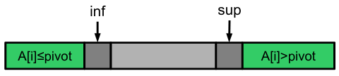

# Notazione asintotica

## Definizione (O-grande)
Data una funzione di costo $g(n)$ definiamo l'insieme di funzioni che rappresentano un **limite asintotico superiore** per $g(n)$ come
$$ O(g(n)) = \{ f(n) \mid \exists c > 0, n_0 \geq 0 \text{ t.c. } \forall n \geq n_0, f(n) \leq cg(n) \} $$

## Definizione ($\Omega$-grande)
Data una funzione di costo $g(n)$ definiamo l'insieme di funzioni che rappresentano un **limite asintotico inferiore** per $g(n)$ come
$$ \Omega(g(n)) = \{ f(n) \mid \exists c > 0, n_0 \geq 0 \text{ t.c. } \forall n \geq n_0, f(n) \geq cg(n) \} $$

## Definizione ($\Theta$)
Data una funzione di costo $g(n)$ definiamo l'insieme di funzioni **asintoticamente equivalenti** a $g(n)$ come
$$ \Theta(g(n)) = \{ f(n) \mid \exists c_1, c_2 > 0, n_0 \geq 0 \text{ t.c. } \forall n \geq n_0, c_1 g(n) \leq f(n) \leq c_2 g(n) \} $$

## Teorema
$$ f(n) = \Theta(g(n)) \iff f(n) = O(g(n)) \land f(n) = \Omega (g(n))$$

## Definizione (o-piccolo)
Data una funzione di costo $g(n)$ definiamo l'insieme di funzioni che sono **domiante asintoticamente** da $g(n)$ come
$$ o(g(n)) = \{ f(n) \mid \forall c > 0, \exists n_0 \geq 0 \text{ t.c. } \forall n \geq n_0, f(n) < cg(n) \} $$

## Definizione ($\omega$-piccolo)
Data una funzione di costo $g(n)$ definiamo l'insieme di funzioni che **dominano asintoticamente** $g(n)$ come
$$ \omega(g(n)) = \{ f(n) \mid \forall c > 0, \exists n_0 \geq 0 \text{ t.c. } \forall n \geq n_0, f(n) > cg(n) \} $$

## Analisi ammortizzata
Differisce dal costo medio perchè **calcola la media del costo di una sequenza di operazioni**

### Metodo dell'aggregazione
Determiniamo un limite superiore al costo totale di una sequenza di $n$ operazioni e dividiamo per $n$

### Esempio
        INSERIRE ESEMPIO
---

### Metodo degli accantonamenti
- Assegnamo un _costo ammortizzato_ ad ogni operazione
- Ogni operazione viene addebitata con il suo costo ammortizzato
- Salviamo come _credito_ la differenza tra il suo costo ammortizzato e il costo reale
- Se il costo reale è più alto, usiamo il credito
- Il costo ammortizzato è corretto se il **credito non è mai negativo**

### Esempio
        INSERIRE ESEMPIO


# Equazioni di ricorrenza

## Metodo dell'iterazione
Aproccio di tipo bruteforce, iteriamo fino a che non vediamo un pattern per il passo $i$ e da lì calcoliamo il costo in base a quando termina

### Esempio
        INSERIRE ESEMPIO
---

## Metodo della sostituzione
Usato per _validare_ un'ipotesi
- Ipotizziamo una soluzione
- Usiamo al definizione di $O, \Omega, \Theta$ per verificarla induttivamente

### Esempio
        INSERIRE ESEMPIO
---

## Metodo dell'albero di ricorsione
È la versione su albero del metodo iterativo
- Generiamo l'albero di ricorsione dall'equzione di ricorrenza
- Calcoliamo il numero di nodi ad ogni livello dell'albero
- Identifichiamo qualche schema ricorrente legato al livello dell'albero

### Esempio
        INSERIRE ESEMPIO
---

## Master Theorem
Risolve equazioni di ricorrenza nella forma

$$ T(n) = aT(n/b) + f(n) \qquad \text{con }a \geq 1, b > 1 \text{ costanti e } f(n) \text{ asintoticamente positiva} $$

Si consideri la seguente equazione di ricorrenza

$$ f(n) = \begin{cases}
        d                       & \text{if } n\text{ is even} \\ 
        aT(n/b) + cn^\beta      & \text{if } n\text{ is odd} 
\end{cases} $$

dove $a \geq 1$, $b > 1$ e $c$, $d$ costanti. Sia $\alpha = \log_b{a} = \frac{\log_k{a}}{\log_k{b}}$. Allora

- Se $\alpha > \beta$ allora $T(n) = \Theta(n^\alpha)$
- Se $\alpha = \beta$ allora $T(n) = \Theta(n^\alpha \log n)$
- Se $\alpha < \beta$ allora $T(n) = \Theta(n^\beta)$

### Esempio
        INSERIRE ESEMPIO

# Strutture Dati Elementari
Definisce _come_ i dati sono logicamente organizzati e le _operazioni_ per accedervi e modificarli, ma _non quali_ dati sono memorizzati

## Dizionario
- Contiene un insieme di *chiavi* univoche
- Ogni chiave è associata ad un *valore*
- I valori possono essere duplicati, le **chiavi** sono **uniche**

Operazioni base:
- `Search(Key k)`: Cerca l'oggetto associato alla chiave $k$
- `Insert(Key k, Data d)`: Aggiunge la coppia $(k, d)$ al Dizionario
- `Delete(Key k)`: Elimina la coppia $(k, d)$ dal Dizionario

## Dizionario su Array Ordinato
Idea: usiamo un array per salvare le coppie *(Key, Data)* e lo manteniamo ordinato rispetto a *Key*

- `Search(Key k)`: Cerca la chiave $k$ con ricerca binaria
  - Ricerca binaria su array ordinato
  - Costo: $O(\log n)$
- `Insert(Key k, Data d)`: Cerca con ricerca binaria, sposta in avanti tutte le coppie con chiavi $> k$
  - Ricerca binaria modificata, spostamento e inserimento
  - Costo: $O(\log n) + O(n) + O(1) = O(n)$
- `Delete(Key k)`: Elimina la coppia $(k, d)$ dal Dizionario, cercandola con ricerca binaria
  - Ricerca binaria e spostamento
  - Costo: $O(\log n) + O(n) = O(n)$

## Dizionario su Lista Concatenata
Idea: lista concatenata non ordinata per memorizzare le coppie

- `Search(Key k)`: Cerca la chiave $k$ con ricerca sequenziale partendo dalla testa
  - Ricerca sequenziale
  - Costo: $O(n)$
- `Insert(Key k, Data d)`: Inserisce la coppia in testa alla lista
  - Inserimento
  - Costo: $O(1)$
- `Delete(Key k)`: Elimina la coppia $(k, d)$ dal Dizionario, cercandola con ricerca sequenziale
  - Ricerca sequenziale ed eliminazione
  - Costo: $O(n)+ O(1) = O(n)$

### Confronto tra diverse implementazioni
| Funzione | Array Ordinato | Lista Concatenata |
| --- | --- | --- |
| `Search` | $O(\log n)$ | $O(n)$ |
| `Insert` | $O(n)$ | $O(1)$ |
| `Delete` | $O(n)$ | $O(n)$ |

---

## Liste concatenate semplici (Singly Linked List)
- Elementi organizzati in ordine sequenziale
- Ogni nodo `x` contiene:
  - `x.key`: un valore chiave
  - `x.next`: un puntatore al nodo successivo
- Se `x.next = NIL` allora `x` è l'ultimo nodo della lista
- Un nodo può contenere più dati oltre alla chiave
- Può essere visitata in un'unica direzione (testa $\rightarrow$ coda)

## Liste doppiamente concatenate (Doubly Linked List)
- Elementi organizzati in ordine sequenziale
- Ogni nodo `x` contiene:
  - `x.key`: un valore chiave
  - `x.next`: un puntatore al nodo successivo
  - `x.prev`: un puntatore al nodo precedente
- Se `x.next = NIL` allora `x` è l'ultimo nodo della lista
- Se `x.prev = NIL` allora `x` è il primo nodo della lista
- Un nodo può contenere più dati oltre alla chiave
- Può essere visitata in entrambe le direzioni

## Liste concatenata circolare (Circular Linked List)
- Elementi organizzati in ordine sequenziale
- Ogni nodo `x` contiene:
  - `x.key`: un valore chiave
  - `x.next`: un puntatore al nodo successivo
  - `x.prev`: un puntatore al nodo precedente
- `x.next = NIL` dell'ultimo elemento punta al primo nodo
- `x.prev = NIL` del primo elemento punta all'ultimo nodo
- Un nodo può contenere più dati oltre alla chiave
- Può essere visitata in entrambe le direzioni
- L'accesso dalla testa alla coda e viceversa è veloce

## Pila (Stack)
Una Pila è una struttura dati che supporta due operazioni principali
- `POP`: rimuove l'elemento aggiunto più di recente
- `PUSH`: aggiunge un nuovo elemento alla struttura

### Implementazione con Liste concatenate semplici
- `POP`: rimuove la testa della lista
- `PUSH`: inserisce l'elemento in testa
- Pro: Dimensione illimitata
- Contro: Piccolo Overhead di memoria

### Implementazione con Array
- `POP`: rimuove l'ultimo elemento dell'array
- `PUSH`: inserisce l'elemento nella prima posizione libera
- Pro: Nessun Overhead di memoria
- Contro: Dimensione limitata

In entrambi i casi `POP` e `PUSH` costano $O(1)$

### Strategia con Array Dinamico
Raddoppiamo la dimensione dell'array quando non c'è spazio libero e la dimezziamo quando l'occupazione è di 1/4

Questo aumenta il costo nel caso pessimo ($O(n)$ per entrambi i casi) ma impedisce l'overflow e ottimizza la memoria

Con un'analisi ammortizzata vediamo che il costo medio è ancora $O(1)$ per entrambe le operazioni

## Coda (Queue)
Una Coda è una struttura dati che supporta due operazioni principali
- `DEQUEUE`: aggiunge un elemento in fondo alla coda
- `ENQUEUE`: rimuove l'elemento in testa alla coda

Gli elementi sono rimossi nello stesso ordine in cui sono inseriti

### Implementazione con Liste concatenate Circolari
- `ENQUEUE`: inserisce l'elemento in coda alla lista
- `DEQUEUE`: rimuove la testa della lista
- Pro: Dimensione illimitata
- Contro: Piccolo Overhead di memoria

### Implementazione con Liste concatenate Semplici
- `ENQUEUE`: inserisce l'elemento in coda alla lista (Lo teniamo salvato)
- `DEQUEUE`: rimuove la testa della lista
- Pro: Dimensione illimitata
- Contro: Piccolo Overhead di memoria

### Implementazione con Array Circolari
- `ENQUEUE`: inserisce l'elemento in `A.tail`
- `DEQUEUE`: rimuove l'elemento in `A.head`
- Pro: Nessun Overhead di memoria
- Contro: Dimensione limitata

In tutti i casi `ENQUEUE` e `DEQUEUE` costano $O(1)$

## Alberi
È una struttura dati non lineare ad albero gerarchico

È un *insieme di nodi* e un'*insieme di archi* che connettono i nodi. Esiste *un solo percorso* per andare da un noto ad un altro

Un Albero è *ordinato* se i figli di ogni nodo sono ordinati

Un Albero è *radicato* se uno dei suoi nodi è identificato come radice

### Alberi Binari
Un Albero in cui ogni nodo ha *massimo* due figli

- Un Albero Binario è un Albero *ordinato*
- Ogni nodo può avere un figlio sinistro e/o destro

### Definizioni
- Profondità
  - La lunghezza del percorso che va dalla radice al nodo `u`
- Livello
  - L'insieme di tutti i nodi alla stessa profondità
- Altezza
  - La massima profondità dell'Albero
- Grado
  - Il numero dei figli di un nodo

## Algoritmi di visita su Alberi
Algoritmo per visitare tutti i nodi di un Albero

### Visita in profondità o Depth-First Search (DFS)
La ricerca va in profondità il più possibile prima di visitare il nodo successivo

Ne esistono tre varianti: pre-ordine, post-ordine e in-ordine

Usiamo la ricorsione:
```
function Preorder (Tree T)
        if T != NIL then
                visit(T)
                Preorder(T.left)
                Preorder(T.right)

function Inorder (Tree T)
        if T != NIL then
                Inorder(T.left)
                visit(T)
                Inorder(T.right)

function Postorder (Tree T)
        if T != NIL then
                Postorder(T.left)
                Postorder(T.right)
                visit(T)
```
Costo per tutti i casi: $\Theta(n)$

### Visita in ampieza o Breadth-First Search (BFS)
La ricerca viene eseguita livello per livello

Usiamo una coda:
```
function BFS(Tree T)
        Let Q be a new Queue
        if T != NIL then
                Enqueue(Q, T)
        while Q.size != 0 do
                x = Dequeue(Q)
                visit(x)
                if x.left != NIL then
                        Enqueue(Q, x.left)
                if x.right != NIL then
                        Enqueue(Q, x.right)
```
Costo: $\Theta(n)$

### Implemetazioni
- Alberi Binari tramite puntatori
  - left: putatore al figlio sinistro
  - right: puntatore al figlio destro
- Alberi non Binari tramite Array di puntatori
  - Il numero masssimo di figli è fisso
  - Rischio di sprecare spazio
- Alberi non Binari tramite Liste Concatenate Semplici
  - Ogni nodo ha un puntatore al primo figlio
  - Ogni nodo ha un puntatore al fratello successivo

# Algoritmi di decisione su Alberi

## MiniMax
Algoritmo ricorsivo per individuare la migliore mossa possibile in un gioco secondo il criterio di minimizzare la massima perdita possibile

L'algoritmo è esatto quando è possibile visitare tutto il Game Tree

```
function MiniMax(Tree T, bool playerA) -> int
        if isLeaf(T) then
                eval = evaluate(T)
        else if playerA == true then                            MAX player
                eval = −∞
                for c ∈ children(T) do
                        eval = max(eval, MiniMax(c, false))
        else                                                    MIN player
                eval = ∞
                for c ∈ children(T) do
                        eval = min(eval, MiniMax(c, true))
        return eval
```

L'algoritmo implementa una visita in profondità post-ordine
Considerando $n$ nodi e $h$ come altezza dell'albero:
- Costo tempo: $\Theta(n)$
- Costo memoria: $O(h)$

La grandezza dell'albero dipende dal gioco

## AlphaBeta pruning
Ottimizzazione dell'algoritmo MiniMax

Non è necessario infatti visitare tutto l'albero

```
function AlphaBeta(Tree T, bool playerA, int α, int β) -> int
        if isLeaf(T) then
                eval = evaluate(T)
        else if playerA == true then                            MAX player
                eval = −∞
                for c ∈ children(T) do
                        eval = max(eval, MiniMax(c, false, α, β))
                        α = max(eval, α)
                        if β ≤ α then                           β cutoff
                                break
        else                                                    MIN player
                eval = ∞
                for c ∈ children(T) do
                        eval = min(eval, MiniMax(c, true, α, β))
                        β = min(eval, β)
                        if β ≤ α then                           α cutoff
                        break
        return eval
```
Costo nel caso pessimo uguale, ma mediamente "potiamo" l'albero da controllare, con uno speed-up quadratico nel caso ottimo

### AlphaBeta pruning con profontià limite
Se il Game Tree è troppo grande limitiamo la ricerca ad un livello massimo di profondità e usiamo una funzione euristica per valutare le configurazioni non finali

In questo caso possiamo anche scegliere la mossa che ci porta alla vittoria prima
```
function AlphaBetaDepth(Tree T, bool playerA, int α, int β, int depth) -> int
        if depth == 0 or isLeaf(T) then
                eval = evaluate(T, depth)
        else if playerA == true then                            MAX player
                eval = −∞
                for c ∈ children(T) do
                        eval = max(eval, MiniMax(c, false, α, β, depth - 1))
                        α = max(eval, α)
                        if β ≤ α then                           β cutoff
                                break
        else                                                    MIN player
                eval = ∞
                for c ∈ children(T) do
                        eval = min(eval, MiniMax(c, true, α, β, depth - 1))
                        β = min(eval, β)
                        if β ≤ α then                           α cutoff
                        break
        return eval
```

## IterativeDeepening
```
function IterativeDeepening(Tree T, bool playerA, int depth) -> int
        α = MinAlpha
        β = MaxBeta
        for d = 0, ..., depth do
                eval = AlphaBeta(T, playerA, α, β, d)
        return eval
```

Visita in ampiezza fino a profondità d.

Se il timeout sta per scadere scegliamo la mossa migliore trovata al livello d-1

Questo algoritmo occupa una quantità di memoria di costo *lineare*

In termini di tempo ha lo stesso costo di AlphaBeta pruning puro

## Casi ripetuti
Molti stati di gioco compaiono più volte nell'albero, per velocizzare la ricerca possiamo individuarli e gestirli

# Alberi Binari di Ricerca
Anche chiamati BST (Binary Search Tree). Permettono una ricerca binaria sulla struttura Albero Binario

Tutte le operazioni hanno un costo proporizionale all'altezza dell'albero

Definizione Albero Binario di Ricerca:
- Albero Binario
- Ogni nodo `v` contiene una chiave e dati assocciati ad essa
- Tutte le chiavi del sottoalbero sinistro di `v` sono $\leq$ `v.key` e tutte le chiavi del sottoalbero destro di `v` sono $\geq$ `v.key`

Operazioni:
- `search(T, k)`: ritorna il nodo con chiave `k` in `T`
- `max(T)`: ritorna il nodo con chiave massima `k` in `T`
- `min(T)`: ritorna il nodo con chiave minima `k` in `T`
- `predecessor(T)`: ritorna il nodo che precede `T` quando i nodi sono ordinati rispetto ad una visita in ordine
- `successor(T)`: simmetrica rispetto a `predecessor(T)`
- `insert(T, k, d)`: inserisce un nodo con chiave `k` e dati `d` in `T`
- `delete(T, k)`: rimuove il nodo con chiave `k` in `T`

### Implementazione `insert`
```
function insert(BST T, Key k, Data d) -> BST
        N = new BST(k, d), P = NIL, S = T
        while S != NIL do                       Search position
                P = S
                if k < S.key then
                        S = S.left
                else
                        S = S.right
        N.parent = P                            Insert node
        if P != NIL and k < P.key then
                P.left = N
        else if P != NIL then
                P.right = N
        if T == NIL then return N else return T
```
### Implementazione `delete`
```
function delete(BST T, Key k) -> BST                             Returns the (new) root
        v = search(T, k)
        if v != NIL then
                if v.left == NIL or v.right == NIL then         (1-2) Foglia da rimuovere o ha un singolo figlio
                        return deleteNode(T,v)
                else                                            (3) Ha due figli
                        u = predecessor(v)
                        v = u                                   v.key = u.key and v.data = u.data
                        return deleteNode(T, u)


function deleteNode(BST T, BST v) -> BST
        p = v.parent
        if p != NIL then                                                                v is not the root
                if isLeaf(v) then                                                       (1) Foglia da rimuovere
                        if p.left == v then p.left = NIL else p.right = NIL
                else if v.right != NIL then                                             (2) Ha un singolo figlio
                        if p.left == v then p.left = v.right else p.right = v.right
                else if v.left != NIL then                                              (2) Ha un singolo figlio
                        if p.left == v then p.left = v.left else p.right = v.left
        else                                                                            v = T is the root
                if isLeaf(v) then T = NIL                                               (1) Foglia da rimuovere
                else if v.right != NIL then T = v.right                                 (2) Ha un singolo figlio
                else if v.left != NIL then T = v.left                                   (2) Ha un singolo figlio
        delete(v)
        return T
```


|                   | `SEARCH`     | `INSERT` | `DELETE` |
| ---               | ---          | ---      | ---      |
| Array Ordinato    | $O(\log n)$ | $O(n)$   | $O(n)$   |
| Liste Concatenate | $O(n)$       | $O(1)$   | $O(n)$   |
| Alberi BST        | $O(h)$       | $O(h)$   | $O(h)$   |

Nota: $h = O(n)$

# Alberi AVL
Se riusciamo a mantenere un Albero Binario Bilanciato rispetto all'altezza le operazioni saranno più rapide

Le operazioni `search`, `insert` e `delete` hanno costo $O(\log n)$ nel caso pessimo con questa struttura dati, dobbiamo preoccuparci però di *mantenere l'albero bilanciato*

```
function update-height(AVL T)
        if T != NIL then
                nh = lh = rh = 0
                if T.left != NIL then
                        lh = T.left.height
                if T.right != NIL then
                        rh = T.right.height
                if lh != 0 or rh != 0 then
                        nh = max(lh, rh) + 1
                T.height = nh

function β(AVT T) -> int
        lh = rh = 0
        if T.left != NIL then
                lh = T.left.height
        if T.right != NIL then
                rh = T.right.height
        return lh − rh
```
- Entrambe costano $O(1)$
- `update-heigth` nel caso peggiore deve essere richiamata per tutti i nodi in un percorso radice-foglia
- Possiamo interrompere l’aggiornamento se la nuova altezza non varia rispetto alla precedente

## Rotazioni
Un rotazione semplice serve per ribilanciare l'albero


Nota: Preserva le proprietà di ordine dei BST

### Rotazione a Destra 
```
function rotateDX(AVL T , AVL u) -> AVL
        if u != NIL and u.left != NIL then
                v = u.left
                v.parent = u.parent
                u.parent = v
                u.left = v.right
                v.right = u
                if v.parent == NIL then                v is the new root
                        T = v
                else                                    parent update
                        if v.parent.left == u then
                                v.parent.left = v
                        else
                                v.parent.right = v
        return T
```
- Costo: $O(1)$
- Ritorna la nuova radice dell'Albero AVL

### Rotazione a Sinistra
Simmetrica rispetto a `rotateDX`

A seguito di un inserimento o di una rimozione possiamo avere l'Albero sbilanciato in 4 modi diversi

| SS                  | DD                  | SD                       | DS                        |
| ---                 | ---                 | ---                      | ---                       |
| Rotazione DX su `u` | Rotazione SX su `u` | Rotazione SX su `u.left` | Rotazione DX su `u.right` |
|                     |                     | Rotazione DX su `u`      | Rotazione SX su `u`       |

Quindi nel caso dell'**inserimento** di un nodo:
- Si inserisce come per un Albero BST 
  - Costo: $O(\log n)$
- Si riaggiornano le altezze dei sotto-alberi
  - Costo: $O(\log n)$
- Se è sbilanciato ($\beta(u) > 1$ o $\beta(u) < -1$) si ribilancia l'Albero
  - Costo: $O(1)$

Quindi nel caso della **rimozione** di un nodo:
- Si rimuove come per un Albero BST 
  - Costo: $O(\log n)$
- Si riaggiornano le altezze dei sotto-alberi
  - Costo: $O(\log n)$
- Se è sbilanciato ($\beta(u) > 1$ o $\beta(u) < -1$) si ribilancia l'Albero
  - Costo: $O(1)$


## Ricapitolando
|                   | `SEARCH`     | `INSERT`     | `DELETE`     |
| ---               | ---          | ---          | ---          |
| Array Ordinato    | $O(\log n)$ | $O(n)$       | $O(n)$       |
| Liste Concatenate | $O(n)$       | $O(1)$       | $O(n)$       |
| Alberi BST        | $O(h)$       | $O(h)$       | $O(h)$       |
| Alberi AVL        | $O(\log n)$ | $O(\log n)$ | $O(\log n)$ |

# Tabelle Hash
Struttura dati estremamente efficente per le operazioni basilari di un Dizionario

L'idea alla base è quella di generalizzare l'indicizzazione di un array ordinario, rendendo il caso medio molto efficente

Le tabelle ad indirizzamento diretto non sono efficenti in termini di memoria, infatti allcano un array per tutte le possibili chiavi che posso avere, se esse sono poche è utilizzabile, altrimenti non è accettabile

Sia $U$ l'universo delle chiavi possibili

Si usa quindi una *funzione hash* $h: U \rightarrow [0, \dots, m-1]$ su un array di dimensione $m = \Theta(|K|)$

La funzione $h$ trasforma una chiave $k$ in un indice dell'array. Bisogna però evitare collisioni per quanto possibile e nel caso gestirle

## Ridurre Collisioni

Proprietà di uniformità semplice: ogni indice $i = h(k)$ deve essere generato con probabilità $1/m$

### Metodo della divisione
$$h(k) = k \mod m$$

- Vantaggi: Molto efficente
- Svantaggi: Suscettibile a valori specifici di $m$, potrebbe non usare tutto $k$

### Metodo della moltiplicazione
$$h(k) = \lfloor m(kC - \lfloor kC \rfloor ) \rfloor \qquad \qquad C \in ]0, 1[$$

- Esempio:
  - $m = 12, k = 101, C = 0.8 \Rightarrow h(k) = 9$
- Vantaggi: Il valore di $m$ non è critico
- Svantaggi: La costante $C$ influenza la proprietà di uniformità di $h$

### Metodo della codifica algebrica
$$h(k) = (k_n x^n + k_{n-1} x^{n-1} + \dots + k_1 x + k_0) \mod m \qquad \qquad k = k_n k_{n-1} \dots k_1 k_0$$

- $k_i$ è l'$i$-esimo bit della rappresentazione per una qualche base di $k$, o il codice ascii dell'$i$-esimo carattere
- $x$ è una costante
- Esempio, usando la rappresentazione decimale
  - $m = 12, k = 234, x = 3 \Rightarrow h(k) = (2 \times 3^2 + 3 \times 3 + 4) \mod 12 = 7$
- Vantaggi: Dipende da *tutti* i caratteri/bit della chiave
- Svantaggi: Molto costoso da calcolare

### Regola di Horner
$$p(x) = a_n x^n + a_{n-1} x^{n-1} + \dots + a_1 x + a_0 = a_0 + x(a_1 + x(a_2 + x( \dots x(a_{n-1} + a_n x))))$$

Così facendo la funzione hash con la codifica algebrica ha da effettuare $n$ addizioni e $n$ moltiplicazioni, rendendo così il costo lineare

## Gestire Collisioni
Le collisioni non sono eliminabili totalmente, abbiamo due modi per gestirle

### Concatenamento (chaining)
Le chiavi $k$ con lo stesso valore hash $h(k) = i$ sono memorizzate in una lista concatenata (*lista di trabocco*)

Sia $\alpha = n/m$ il *fattore di carico*, il rapporto tra il numero di elementi e la dimensione di una Tabella Hash

Il costo medio di una ricerca con o senza successo è $\Theta (1 + \alpha)$

Quindi se $n = O(m)$ allora $\alpha = O(1) \Rightarrow$ costo medio di ricerca $O(1)$ 

### Indirizzamento aperto (open addressing)
Le chiavi sono tutte memorizzate nella stessa tabella, se uno slot è occupato si occupa il successivo libero

La sequenza di ispezione
$$ h(k, 0), h(k, 1), \dots , h(k, m-1),  $$
deve fornire una *permutazione* degli indici della tabella

Dobbiamo marcare i valori eliminati con `DELETED` invece di `NIL` per trattarli come slot pieni dalla ricerca

`search`, `insert` e `delete` costano $O(m)$ con $m$ dimensione della tabella

Nel caso medio invece dipende dalla strategia di ispezione

### Ispezione lineare
$$ h(k, i) = (h'(k) + i) \mod m $$
Dove $h'(k)$ è una funzione hash ausiliaria

Quando si ha una collisione si ispeziona l'indice successivo

**Problema**: clustering primario
- Lunghe sotto-sequenze occupate
- Uno slot vuoto preceduto da $i$ slot pieni viene riempito con probabilità $(i+1)/m$
- I tempi medi di inserimento e di cancellazione crescono

### Ispezione quadratica
$$ h(k, i) = (h'(k) + c_1 i + c_2 i^2) \mod m \qquad c_1 \neq c_2 $$
dove $h'(k)$ è una funzione hash ausiliaria

**Problema**: clustering secondario
- Se due chiavi hanno la stessa ispezione iniziale, allora le loro sequenze di ispezione sono identiche

### Doppio Hashing
$$ h(k, i) = (h_1 (k) + i h_2 (k)) \mod m$$
dove $h_1 (k), h_2(k)$ sono funzioni hash ausiliarie

- Quando si ha una collisione, si usa la funzione secondaria e l'indice di ispezione per determinare il successivo slot da ispezionare
  - Evita il clustering primario e secondario
- La funzione $h_2$ non deve mai dare il valore hash $0$ e deve permettere di iterare su tutta la tabella

---

Per l'indirizzamento aperto nel caso medio la complessità computazionale è $O(1)$

### Caso medio Hash Table


### Fattore di carico

Le prestazioni delle Tabelle Hash sono legate al *fattore di carico* $\alpha$. Se il fattore di carico supera una certa soglia si ridimensiona la tabella per mantenere alta l'efficacia

# Ordinamento
Definizioni:
- **Ordinamento in loco**: l'algoritmo permuta gli elementi direttamente nell'array originale, senza usarne un'altro di appoggio
- **Ordinamento stabile**: l'algoritmo preserva l'ordine con cui gli elementi con la stessa chiave compaiono nell'array originale

## Selection Sort
Cerca il minimo in `A[k+1 ... n]` e lo sposta in posizione `k+1`

Costo: $\Theta(n^2)$

## Insertion Sort
Inserisce l'elemento `A[k+1]` nella posizione corretta all'interno del prefisso già ordinato `A[1 ... k]`

Costo: $\Theta(n^2)$

## Bubble Sort
Esegue una serie di scansioni dell'array, ad ogni scansione porta l'elemento massimo nell'ultima posizione

Ovvero

Cerca il massimo in `A[1 ... k]` e lo sposta in posizione `k`

Costo: $\Theta(n^2)$

## Algoritmi divide et impera

- Divide il problema in sottoproblemi più piccoli dello stesso tipo
- Risolve i sottoproblemi ricorsivamente
- Ricombina le soluzione per ottenere la soluzione al problema di partenza

## Quick Sort
- Scegli un elemento `x` del vettore `v`, e partiziona il vettore in due parti considerando gli elementi `≤ x` e quelli `> x`
- Ordina ricorsivamente le due parti
- Restituisci il risultato concatenando le due parti ordinate

Per dividere l'array si usa `partition()`, che procede così:
- Manteniamo due indici, `inf` e `sup`, che vengono fatti scorrere dalle estremità del vettore verso il centro
  - Il sotto-vettore `A[i..inf-1]` è composto da elementi `≤ pivot`
  - Il sotto-vettore `A[sup+1..f]` è composto da elementi `> pivot`
- Quando entrambi (`inf` e `sup`) non possono essere fatti avanzare verso il centro, si scambia `A[inf]` e `A[sup]`




Dopo che avrò risolto i sottoproblemi l'array sarà già ordinato, non ci sarà bisogno di fare la parte *impera*

Il costo di QuickSort dipende da `partition()`, che nel caso peggiore ha costo $\Theta(n^2)$

Nel caso medio però si ha costo $\Theta(n \log n)$, cosa che lo rende molto più veloce rispetto agli algoritmi visti in precedenza

Per avere sempre un caso medio possiamo scegliere in maniera pseudo-casuale il pivot

## Merge Sort

- Dividere A[] in due meta' A1[] e A2[] (senza permutare) di dimensioni uguali
- Applicare ricorsivamente Merge Sort a A1[] e A2[]
- Fondere (merge) gli array ordinati A1[] e A2[] per ottenere l'array A[] ordinato

Operazione `merge()` complessa:
```
private static void merge(Comparable A[], int i1, int f1, int f2)
        {
        Comparable[] X = new Comparable[f2 - i1 + 1];
        int i = 0, i2 = f1 + 1, k = i1;
        while (i1 <= f1 && i2 <= f2) {
                if (A[i1].compareTo(A[i2]) < 0)
                        X[i++] = A[i1++];
                else
                        X[i++] = A[i2++];
        }
        if (i1 <= f1)
                for (int j = i1; j <= f1; j++, i++) X[i] = A[j];
        else
                for (int j = i2; j <= f2; j++, i++) X[i] = A[j];
        for (int t = 0; k <= f2; k++, t++) A[k] = X[t];
}
```


Costo: $T(n) = 2T(n/2) + n = \Theta(n \log n)$

Non dipende dalla configurazione iniziale, quindi il caso medio, ottimo e pessimo sono equivalenti

Rispetto al QuickSort occupa più spazio, molto difficile da fare in loco

## Heap Sort
- Utilizzare una struttura dati detta heap per ordinare un array
- Costo computazionale: $O(n \log n)$
- Ordinamento sul posto

**Heap**: Alberi Binari "Quasi Completi" in cui il valore massimo è sempre la radice, inoltre è possibile salvarlo su un array per accesso in tempo $O(1)$

Tutti i nodi sono spostati verso sinistra, come se riempissi l'albero con una visita in ampiezza

**Array Heap**: Rappresentazione di un Albero Binario Heap tramite Array
- Array `A` di lunghezza $\geq$ `A.heapsize`
- `A[0]` vuoto
- `A[1]` contiene la radice
- `parent(i) = i/2`
- `left(i) = 2*i`
- `right(i) = 2*i + 1`

Operazioni base:
- `findMax()`: Restituisce il massimo
  - Restituisce `A[1]`
  - Costo: $\Theta(1)$
- `fixHeap()`: Ripristina la proprietà di *max-heap*
  - Confronto ricorsivamente `A[i]` con il massimo dei suoi figli e vedo se la proprietà è verificata, in caso contrario scambio i due elementi
  - Costo: Al peggio il numero di scambi è uguale alla profondità dell'array, quindi $O(\log n)$
- `heapify()`: Costruisce un *heap* a partire da un array non ordinato
  - Ricorsivamente per `A[2*i]` e `A[2*i + 1]`, applicando `fixHeap()` volta per volta
  - Costo: $T(n) = 2T(n/2) + \log n = O(n)$
- `deleteMax()`: rimuovi l'elemento massimo da un *max-heap*, metto il valore più piccolo e applico `fixHeap()`
  - Costo: come `fixHeap()`, $O(\log n)$

**Heap Sort**: Costruisco un *max-heap* ed estraggo ogni volta il massimo togliendolo dal *max-heap* e restituisco l'array ordinato
```
public static void heapSort(Comparable S[]) {
        heapify(S, S.length - 1, 1);
        for (int c = (S.length - 1); c > 0; c--) {
                Comparable k = findMax(S);
                deleteMax(S, c);
                S[c] = k;
        }
}
```
Costo totale: $O(n) + O(\displaystyle \sum_{c=n} ^{1} {\log c}) = O(n \log n)$

---

***Possibile fare meglio di $O(n \log n)$ con confronti? No***

## Counting Sort
- I valori dell'array appartengono ad un intervallo conosciuto `[0, k-1]`
- Costruisco un array di dimensione `k` che per ogni volta che incontro il valore aggiorno un contatore all'indice corrispondente
- Ricolloco i valori per il numero di volte trovati nell'array
- Se i valori possibili sono $k = O(n)$ allora il costo è $O(n)$

## Pigeonhole Sort (Bucket Sort)
Se ciò che dobbiamo ordinare non sono numeri interi possiamo usare un array di liste concatenate al posto di un array di interi

Se però il valore di `k` diventa troppo grande diventa ingestibile

## Radix Sort
Se però riusciamo a rendere Bucket Sort stabile possiamo ordinare a partire dalle cifre meno significative

        DA FINIRE

## Riassunto ordinamento


# Selezione del k-esimo minimo
Per trovare il minimo di un array abbiamo $\Theta(n)$ confronti, se vogliamo trovare il k-esimo minimo invece?

## Selection Sort incompleto
```
algorithm select(array A[1..n], int k) -> elem
        for i:=1 to k do
                minIndex := i;
                minValue := A[i];
                for j:=i+1 to n do
                        if (A[j] < minValue) then
                                minIndex := j;
                                minValue := A[j];
                        endif
                endfor
                swap A[i] and A[minIndex];
        endfor
        return A[k];
```
Costo $\Theta(kn)$
Efficente solo se `k << n`

## Heap Select
- Costruisco un *min-heap*
  - Costo: $O(n)$
- Estraggo per $k-1$ volte il minimo
  - Costo: $O(k \log n)$
- Il k-esimo minimo è l'elemento minimo che rimane

Quindi il costo totale è $O(n + k \log n)$

Anche qui rimane efficente solo se `k << n`

Se $k = \Theta(n)$?

## Quick Select
Usa *Divide et Impera*, ma se una partizione è già abbastanza grande da contenere il k-esimo minimo voluto cerco solo in quella

Costo caso pessimo: $\Theta(n^2)$
Costo caso medio: $O(n)$

# Code con priorità
Struttura dati che contiene il minimo o il massimo in un insieme dinamico di chiavi

Operazioni:
- `findMin() -> elem`
  - Restituisce un elemento associato alla chiave minima
  - Costo: $O(1)$
- `insert(elem e, chiave k)`
  - Inserisce un nuovo elemento e con associata la chiave `k`
  - Costo: $O(\log_d n)$
- `delete(elem e)`
  - Rimuove un elemento dalla coda (si assume di avere accesso diretto a tale elemento `e`)
  - Costo: $O(d \log_d n)$
- `deleteMin()`
  - Rimuove un elemento associato alla chiave minima
  - Costo: $O(d \log_d n)$
- `increaseKey(elem e, chiave c)`
  - Incrementa la chiave dell'elemento `e` della quantità `c` (si assume di avere accesso diretto a tale elemento `e`)
  - Costo: $O(d \log_d n)$
- `decreaseKey(elem e, chiave c)`
  - Decrementa la chiave dell'elemento `e` della quantità `c` (si assume di avere accesso diretto a tale elemento `e`)
  - Costo: $O(\log_d n)$

## d-heap
Modifica alla struttura min/max-heap dell'algoritmo *Heap Sort*

L'albero invece di essere binario è d-ario

Un d-heap con $n$ nodi ha altezza $O(\log_d n)$

### Memorizzazione d-heap in array
- Radice in `A[1]`
- Primo figlio in posizione $((i-1) \times d) + 2$
- Ultimo figlio in posizione $(i \times d) + 1$

# Union Find
Struttura dati per gestire *insiemi disgiunti* di oggetti

Operazioni fondamentali:
- `makeSet(elem x)`
  - Crea un insieme il cui unico elemento e rappresentante è `x`
  - `x` non deve appartenere ad un altro insieme esistente
- `find(elem x) -> name`
  - Restituisce il rappresentate dell'unico insieme contenente `x`
- `union(name x, name y)`
  - Unisce i due insiemi rappresentati da `x` e `y`

## QuickFind
- Ogni insieme viene rappresentato con un albero di altezza uno
  - Le foglie dell'albero contengono gli elmenti dell'insieme, e la radice è il rappresentante
  - Possibile rappresentarle con Liste


- `makeSet(elem x)`
  - Crea un albero dove l'unica foglia è `x` e il rappresentante è `x` stesso
  - Costo: $O(1)$
- `find(elem x) -> name`
  - Restituisce il puntantore al padre di `x`
  - Costo: $O(1)$
- `union(name x, name y)`
  - Tutte le foglie del secondo albero vengono spostate nel primo
  - Costo: $O(n)$

## QuickUnion
- Si rappresenta ogni insieme tramite un albero radicato generico
- Ogni nodo dell'albero contiene l'oggetto e il puntatore al padre
- La radice è il rappresentante
- `makeSet(elem x)`
  - Crea un albero con unico nodo `x`
  - Costo: $O(1)$
- `find(elem x) -> name`
  - Risale la lista dei padri di `x` fino a trovare la radice
  - Costo: $O(n)$
- `union(name x, name y)`
  - Appende un albero all'altro
  - Costo: $O(1)$

## Ottimizzazioni possibili
### QuickFind con euristica sul peso
Consiste nel tenere traccia della dimensione degli alberi e quando si vogliono unire due alberi "spostare" quello di dimensione minore

Costo armortizzato di `union` con euristica sul peso: $O(\log n)$

### QuickUnion con euristica sul rango
Bisogna rendere la radice dell'albero più basso figlia della radice dell'albero più alto, in questo modo l'altezza rimane minima mantenendo il costo di `union` costante

Costo medio di `find` con euristica sul rango: $O(\log n)$

# Divide et Impera
- ***Divide***: Dividi il problema in sotto-problemi indipendenti, di dimensioni “minori”
- ***Impera***: Risolvi i sotto-problemi ricorsivamente
- ***Combina***: Unisci le soluzioni dei sottoproblemi per costruire la soluzione del problema di partenza

## Torri di Hanoi
```
        Hanoi(Stack p1, Stack p2, Stack p3, integer n)
                if (n = 1) then
                        p3.push(p1.pop())
                else
                        hanoi(p1, p3, p2, n-1)
                        p3.push(p1.pop())
                        hanoi(p2, p1, p3, n-1)
        endif
```
Divide:
- $n-1$ dischi da `p1` a `p2`
- 1 disco da `p1` a `p3`
- $n-1$ dischi da `p2` a `p3`

## Ricerca del sottovettore massimo
Esistono in un vettore di $n$ elementi $n(n+1)/2$ elementi

Varie versioni:
1) Confrontare tra loro tutti i $n^2$ sottovettori e trovare il massimo, ma il costo è cubico
2) Un modo più furbo è quello di non fare tre for ma solo due, ciclando l'inizio $n$ volte e per ogni volta allungare il sottovettore
3) Usare divide-et-impera

### Sottovettore massimo con divide-et-impera
- Dividiamo il vettore `A` in due parti `A[0..m], A[m], A[m+1..n-1]`, ho tre casi:
  - Il sottovettore massimo si trova nella *prima metà*
  - Il sottovettore massimo si trova nella *seconda metà*
  - Il sottovettore massimo si trova *a cavallo* tra le due metà
- Nel caso si trovi nella prima o nella seconda metà applico la ricorsione
- Per il terzo caso cerco il sottovettore massimo adiacente ad `A[m]` sia a destra che a sinistra
- Infine restituisco il massimo tra quelli che ho trovato per i tre casi
- Costo: $O(n \log n)$

# Greedy
Ricerca della soluzione *golosa*, si passa ad un problema più semplice senza tornare mai sui propri passi

Svantaggi:
- Non sempre applicabile
- Non sempre soluzione ottima

Vantaggi:
- Molto intuitiva

        INSERIRE PROBLEMI NOTI ED ESEMPI

# Programmazione dinamica
Suddivisione del problema in sottoproblemi più semplici risolvibili in modo efficace conoscendo la soluzione di sottoproblemi precedenti

Si differenzia da Divide et Impera perchè segue un approccio bottom-up

- Definizione dei sottoproblemi
- Definizione delle soluzioni ai sottoproblemi
- Quale sottoproblema restituisce la soluzione al problema originale?

...

        INSERIRE PROBLEMI NOTI ED ESEMPI

# Grafi
Problemi sui Grafi
- Visite
  - Visite in ampiezza (Cammini Minimi da Singola Sorgente)
  - Visite in profondità (Ordinamento topologico e Componenti Fortemente Connesse)
- Alberi di Copertura Minimi (MST)
- Cammini Minimi
  - Da singola sorgente
  - Tra tutte le coppie di vertici

## Definizioni

Un grafo **orientato** $G$ è una coppia $(V, E)$ dove:
- Insieme finito di *vertici* $V$
- Insieme di *archi* $E$: relazione binaria tra vertici

Un grafo **non orientato** $G$ è una coppia $(V, E)$ dove:
- Insieme finito di *vertici* $V$
- Insieme di *archi* $E$: coppie non ordinate

L'arco $(v, w)$ è **incidente** da $v$ in $w$

Un vertice $w$ è **adiacente** a $v$ se e solo se $(v, w) \in E$

Il **grado** di un vertice è il numero di archi che partono da esso

In un grafo orientato il **grado entrante (uscente)** di un vertice è il numero di archi incidenti in (da) esso, il suo **grado** totale è la somma di quello entrante e di quello uscente

La struttura dati deve supportare le seguenti operazioni:
- `NumVertici() -> intero`
- `NumArchi() -> intero`
- `grado(vertice v) -> intero`
- `archiIncidenti(vertice v) -> (arco, arco, ..., arco)`
- `estremi(arco e) -> (vertice, vertice)`
- `opposto(vertice x, arco e) -> vertice`
- `sonoAdiacenti(vertice x, vertice y) -> booleano`
- `aggiungiVertice(vertice v)`
- `aggiungiArco(vertice x, vertice y)`
- `rimuoviVertice(vertice v)`
- `rimuoviArco(arco e)`

## Implementazione con Liste di incidenza (Grafo non orientato)
Array per tutti i vertici, ogni cella dell'array indica gli archi a qui il vertice è incidente

Considerando $n = |V|, m = |E|, \delta(x) = \text{grado di }x$

- `grado(vertice v) -> intero`
  - Costo: $O(\delta(v))$
- `archiIncidenti(vertice v) -> (arco, arco, ..., arco)`
  - Costo: $O(\delta(v))$
- `sonoAdiacenti(vertice x, vertice y) -> booleano`
  - Costo: $O(min\{\delta(x), \delta(y)\})$
- `aggiungiVertice(vertice v)`
  - Costo: $O(1)$
- `aggiungiArco(vertice x, vertice y)`
  - Costo: $O(1)$
- `rimuoviVertice(vertice v)`
  - Costo: $O(m)$
- `rimuoviArco(arco e)`
  - Costo: $O(\delta(x) + \delta(y))$

## Implementazione con Matrice di adiacenza (Grafo non orientato)
Matrice $|V| \times |V|$ per indicare se il l'arco $(x, y)$ esiste

Considerando $n = |V|, m = |E|, \delta(x) = \text{grado di }x$

- `grado(vertice v) -> intero`
  - Costo: $O(n)$
- `archiIncidenti(vertice v) -> (arco, arco, ..., arco)`
  - Costo: $O(n)$
- `sonoAdiacenti(vertice x, vertice y) -> booleano`
  - Costo: $O(1)$
- `aggiungiVertice(vertice v)`
  - Costo: $O(n^2)$
- `aggiungiArco(vertice x, vertice y)`
  - Costo: $O(1)$
- `rimuoviVertice(vertice v)`
  - Costo: $O(n^2)$
- `rimuoviArco(arco e)`
  - Costo: $O(1)$

Nel caso il Grafo sia orientato avremo semplicemente una tabella non simmetrica lungo la diagonale

Analogo per i Grafi Pesati

## Cammini

Un **cammino** in $G=(V, E)$ è una sequenza di vertici $<w_0, w_1, \dots, w_k>$ tale che $\{w_i, w_{i+1}\} \in E$ per $0 \leq i \leq k-1$

La **lunghezza** del cammino è il numero di archi attraversati

Un cammino si dice **semplice** se tutti i suoi vertici sono distinti

Se esiste un cammino $c$ tra i vertici $v$ e $w$, si dice che $w$ è raggiungibile da $v$ tramite $c$

Se $G$ è un grafo *non orientato*, diciamo che è **connesso** se esiste un cammino da ogni vertice ad ogni altro vertice

Se $G$ è un grafo *orientato*, diciamo che è **fortemente connesso** se esiste un cammino da ogni vertice ad ogni altro vertice

Se $G$ è un grafo *orientato*, il grafo ottenuto ignorando la direzione degli archi e dei cappi è detto **versione non orientata** di $G$

Se $G$ è un grafo *non orientato*, il grafo ottenuto inserendo due archi orientati opposti per ogni arco non ordientato del grafo è detto **versione orientata** di $G$

Se un grafo $G$ *orientato* non è fortemente connesso, ma la sua versione non orientata è connessa, diciamo che $G$ è **debolmente connesso**

Un **ciclo** è un cammino di lunghezza $\geq 1$ tale che la sorgente e l'arrivo sono lo stesso vertice

In grafi non ordientati, un ciclo di lunghezza $2$ è detto **banale**

Un ciclo è **semplice** se i nodi del cammino sono tutti distinti

Un grafo **aciclico** è un grafo senza cicli (escludendo quelli banali)

Un grafo **non orientato completo** è un grafo che ha un arco tra ogni coppia di vertici

Un **albero libero** è un grafo non orientato connesso aciclico, se un vertice è una radice otteniamo un **albero radicato**

# Algoritmi di Visita dei Grafi
Vogliamo dato un grafo $G = (V, E)$ e un vertice $s \in V$ detto *sorgente* visitare ogni vertice raggiungibile nel grafo dal vertice $s$, visitando ogni nodo una sola volta

Possibile una **visita di ampiezza** (BFS)
- Visita i nodi espandendo la frontiera tra nodi scoperti / da scoprire

E una **visita in profondità** (DFS)
- Visita i nodi andando il più lontano possibile nel grafo

## Visita in Ampiezza (BFS)
- L'algoritmoo esplora il grafo a partire da un nodo $s$ e costruisce l'albero $T$ radicato in $s$ contenente tutti i nodi raggiungibili da esso
- Ogni vertice del grafo può essere:
  - inesplorato: il vertice non è stato ancora incontrato
  - aperto: già incontrato ma non ho esplorato tutti gli archi
  - chiuso: il vertice è stato visitato completamente
- L'algoritmo mantiene un sottoinsieme $F \subseteq T$
  - Se un nodo $v$ sta in $T-F$, significa che $v$ è chiuso
  - Se sta in $F$ allora è aperto
  - Se non sta in $T$ allora è inesplorato

```
algoritmo visitaBFS(G, s) -> albero
        for each v in V do
                v.mark = false
        T = s
        F = neq Queue()
        F.enqueue(s)
        s.mark = true
        s.dist = 0
        while (F non vuoto) do
                u = F.dequeue()
                "visita il vertice u"
                for each v adiacente a u do
                        if (not v.mark) then
                                v.mark = true
                                v.dist = u.dist + 1
                                F.enqueue(v)
                                v.parent = u
                        endif
                endfor
        endwhile
        return T
```
- Insieme $F$ gestito tramite una coda
- `v.mark` è la marcatura del nodo $v$
- `v.dist` è la distanza del nodo $v$ dal vertice $s$
- Costo, considerando $n$ come numero dei vertici e $m$ come numero degli archi:
  - $O(n+m)$ con liste di adiacenza
  - $O(n^2)$ con matrice di adiacenza

L'algoritmo di visita BFS può essere usato per ottenere il percorso più breve tra due vertici

## Visita in profondità (DFS)
Viene utilizzata per coprire l'intero grafo, non solo i nodi raggiungibili da singola sorgente

Restituiamo quindi una foresta, un insieme di alberi, e per ogni nodo calcoleremo il tempo di scoperta e il tempo di "terminazione" di esso

```
global time = 0

algoritmo DFS(Grafo G)
        for each u in V do
                u.mark = white
                u.parent = nil
        endfor
        for each u in V do
                if (u.mark == white) then
                        DFS-visit(u)
                endif
        endfor

algoritmo DFS-visit(vertice u)
        u.mark = gray
        time = time + 1
        u.dt = time
        for each v adiacente a u do
                if (v.mark = white) then
                        v.parent = u
                        DFS-visit(v)
                endif
        endfor
        "visita il vertice u"
        time = time + 1
        u.ft = time
        u.mark = black

```
- Nodi bianchi = inesplorati
- Nodi grigi = aperti
- Nodi neri = chiusi
- `v.dt`: discovery time
- `v.ft`: finish time

La Foresta $DF$ contiene più alberi, e ogni nodo ha l'informazione sul discovery e finish time
- Se $[u.dt, u.ft]$ e $[v.dt, v.ft]$ sono disgiunti allora $u$ e $v$ non sono discendenti
- Se $[u.dt, u.ft]$ è interamente contenuto in $[v.dt, v.ft]$ sono disgiunti allora $u$ è discendente di $v$ in un albero di $DF$
- Se $[v.dt, v.ft]$ è interamente contenuto in $[u.dt, u.ft]$ sono disgiunti allora $v$ è discendente di $u$ in un albero di $DF$

Nei grafi orientati abbiamo più informazioni
- Se $v.dt < u.dt$ e $u.ft < v.ft$ l'arco $(u, v)$ è **all'indietro**
- Se $u.dt < v.dt$ e $v.ft < u.ft$ l'arco $(u, v)$ è **in avanti**
- Se $v.ft < u.dt$ l'arco $(u, v)$ è di **attraversamento a sinistra**

Per verificare che un grafo sia un DAG (Direct Acyclic Graph) basta verificare che non ci siano archi all'indietro dopo una visita di profondità

Un **Ordinamento Topologico** di un DAG è un ordinamento lineare dei suoi vertici tale per cui gli archi "vanno tutti a destra"
- Nota: non è unico
- Dopo una DFS si restituiscono i vertici in ordine di finish time *decrescente*

# Minimum Spanning Tree (MST)
Determinare come interconnettere diversi elementi tra loro minimizzando certi vincoli sulle connessioni

L'albero di copertura minimo (MST) non è sempre unico

Usiamo un approccio Greedy:
- Accresciamo un sottoinsieme $T$ di archi tal che $T$ sia un sottoinsieme di un qualche albero di copertura minimo
- Un arco $(u, v)$ è detto *sicuro* per $T$ se $T \cup (u, v)$ è ancora un sottoinsieme di qualche MST

### Regola del taglio
Scegli un taglio in $G$ che rispetta gli archi già colorati di blu (non passi dai blu). Tra tutti gli archi non colorati che attraversano il taglio seleziona quello con peso minimo e coloralo di blu

### Regola del ciclo
Scegli un ciclo semplice in $G$ che non contenga archi rossi, tra tutti gli archi non colorati seleziona un arco di costo massimoe e coloralo di rosso

Si può costruire un MST applicando in successione una di queste due regole (quando applicabile)

## Algoritmo di Kruskal
Kruskal fissa un ordine di applicazione delle due regole
- Ingrandiamo sottoinsiemi disgiunti di un albero di copertura minimo connettendoli tra loro fino ad avere l'albero finale
- Si considerano gli archi in ordine decrescente di peso
  - Se un arco collega due nodi già collegati tra loro dal MST provvisorio lo coloriamo di rosso
- Ad ogni passo quindi si aggiunge alla foresta un arco di peso minimo
- Per sapere se i due vertici di un arco sono già collegati tra loro possiamo usare **UnionFind**

```
Tree Kruskal-MST(Grafo G=(V, E, w))
        UnionFind UF
        Tree T = albero vuoto
        for i = 1 to G.numNodi() do
                UF.makeSet(i)
        sort(E, w)              // Ordina gli archi di E per il peso w crescente
        for each (u, v) in E do
                Tu = UF.find(u)
                Tv = UF.find(v)
                if (Tu != Tv) then              // evita i cicli
                        T = T + (u, v)          // aggiungi arco
                        UF.union(Tu, Tv)        // unisci componenti
                endif
        endfor
        return T
```
Costo usando *QuickUnion con euristica sul rango*: $n \times O(1) + O(m \log m) + m * O(2 \times T_{find} + T_{union}) = O(n) + O(m \log n) + O(m \log n) = O(m \log n)$

## Algoritmo di Prim
Utilizza solo la regola del taglio
- Si procede mantenendo un singolo albero $T$ che viene fatto crescere via via
- Si parte dalla radice e si interrompe quando tutti i vertici sono stati raggiunti
- Ad ogni passo viene aggiunto l'arco di peso minimo che collega un nodo già raggiungo ad uno non ancora raggiunto

```
integer[] Prim-MST(Grafo G=(V,E,w), nodo s)
        double d[1..n]
        integer p[1..n]
        boolean b[1..n]
        for v = 1 to n do                       // Inizializzazione
                d[v] = ∞
                p[v] = -1
                b[v] = false
        endfor
        d[s] = 0                        // Primo nodo (sorgente)
        CodaPriorita<integer, double> Q
        Q.insert(s, d[s])
        while (not Q.isEmpty()) do
                u = Q.find()
                Q.deleteMin()                   // n deleteMin()
                b[u] = true
                for each (v adiacente a u t.c. not b[v]) do
                        if (d[v] == ∞) then
                                Q.insert(v, w(u,v))             // n insert(), inclusa la prima
                                d[v] = w(u,v)
                                p[v] = u
                        else if (w(u,v) < d[v]) then
                                Q.decreaseKey(v, d[v]-w(u,v))   // O(m) decreaseKey()
                                d[v] = w(u,v)
                                p[v] = u
                        endif
                endfor
        endwhile
return p
```
Costo usando una coda con priorità basata su min-heap
- $n$ `deleteMin()` costano $O(n \log n)$
- $n$ `insert()` costano $O(n \log n)$
- $O(m)$ `decreaseKey()` costano $O(m \log n)$
Totale: $O(n \log n + n \log n + m \log n) = O(m \log n)$

# Cammini minimi
Problema differente dalla ricerca del MST

Qui cerchiamo un singolo cammino minimo da una sorgente ad un arrivo, e questo può non essere presente nel MST

Ci sono diverse formulazioni del problema
1. Ricerca del costo minimo tra una coppia di nodi $u$ e $v$
2. Single-source shortest path
   - Determinare cammini di costo minimo dalla sorgente $s$ a tutti gli altri nodi $u$ del grafo 
3. All-pairs shortest paths
   - Determinare cammini di costo minimo per ogni coppia di nodi $u$ e $v$

Non è noto alcun algoritmo che risolve il problema (1) e non il problema (2)

## Osservazioni
Non esiste un cammino di costo minimo quando:
- La destinazione non è raggiungibile
- Esistono cicli di costo negativo

## Albero dei cammini di costo minimo
Sia $s$ un vertice di un grafo orientato pesato $G = (V, E)$. Allora esiste un albero $T$ che contiene i vertici raggiungiblili da $s$ tale che *ogni cammino* in $T$ sia un cammino *di costo minimo*

Entrambi gli algoritmi che vediamo restituiscono un albero come quello descritto sopra, quindi oltre a sapere il costo del cammino minimo sapremo anche trovare il cammino minimo stesso

La **distanza** $d_{xy}$ tra due nodi $x$ e $y$ il costo del cammino minimo che li connette, se non sono connessi la distanza è $+\infty$
- $d_{vv} = 0, \forall v$
- $d_{xz} \leq d_{xy} + d_{yz}$

## Condizione di Bellman
Per ogni arco $(u, v)$ e per ogni vertice $s$
$$d_{sv} \leq d_{su} + w(u, v)$$

Per la condizione di Bellman si può dedurre che l'arco $(u, v)$ fa parte di un cammino di costo minimo se e solo se
$$d_{sv} = d_{su} + w(u, v)$$

### Tecnica del rilassamento
- Supponiamo di mantenere una stia $D_{sv} \geq d_{sv}$ della lunghezza del cammino di costo minimo tra $s$ e $v$
- Effettuiamo dei passi di "rilassamento", riducendo progressivamente la stima finchè si ha $D_{sv} = d_{sv}$
```
if (D_su + w(u, v) < D_sv) then D_sv = D_su + w(u, v)
```

## Algoritmo di Bellman e Ford
Partendo da una stima del costo del cammino di costo minimo ($+\infty$) effettuiamo passi di rilassamento fino ad aver raggiunto l'arrivo

Ad ogni passo consideriamo tutti gli $m$ archi del grafo ed effettuaimo il passo di rilassamento, dopo $n-1$ iterazioni siamo sicuri di aver calcolato tutti i valori $D_{s v_k}$ corretti

```
double [1..n] BellmanFord (Grafo G=(V, E, w), int s)
        int n = G.numNodi()
        int pred[1..n], u, v
        double D[1..n]
        for v = 1 to n do       //inizializzo D e pred
                D[v] = +inf
                pred[v] = -1
        endfor
        D[s] = 0
        for i = 1 to n-1 do
                for each (u, v) in E do                 // Per ogni arco (lo faccio n-1 volte)
                        if (D[u] + w(u, v) < D[v]) then         // Rilassamento?
                                D[v] = D[u] + w(u, v)
                                pred[v] = u
                        endif
                endfor
        endfor
        
        // Eventuale controllo per cicli negativi
        for each (u, v) in E do
                if (D[u] + w(u, v) < D[v]) then                         // Se posso rilassare ancora
                        error "Il grafo contiene cicli negativi"
                endif
        endfor

        return D
```
- I nodi del grafo sono identificati da degli interi
- `D[v]` è la stima della distanza del nodo `v` alla sorgente `s`
- `pred[v]` è il predecessore del nodo `v` sul cammino di costo minimo che collega `s` con `v`

Costo $O(nm)$

## Algoritmo di Dijkstra
Determina i cammini di costo minimo da singola sorgente nel caso in cui tutti gli archi abbiamo costo $\geq 0$

### Lemma Dijkstra
Sia $G = (V, E, w)$ un grafo orientato con costi degli archi positivi

$T$ rappresenta porzioni di cammini di costo minimo che partono da $s$

L'arco $(u, v)$ con $u \in V(T)$ e $v \not \in V(T)$ che minimizza la quantità $d_{su} + w(u, v)$ appartiene ad un cammino minimo da $s$ a $v$

Versione generica:
```
double [1..n] DijkstraGenerico (Grafo G=(V, E, w), int s)
        int n = G.numNodi()
        int pred[1..n], u, v
        double D[1..n]
        for v = 1 to n do       //inizializzo D e pred
                D[v] = +inf
                pred[v] = -1
        endfor
        D[s] = 0
        while (non ho visitato tutti i nodi raggiungibili da s) do
                Trova l'arco (u, v) incidente su T con D[u] + w(u, v) minimo
                D[v] = D[u] + w(u, v)
                pred[v] = u
        endwhile
        return D
```

Implementiamo la versione effettiva con le **Priority Queue**
```
double [1..n] Dijkstra (Grafo G=(V, E, w), int s)
        int n = G.numNodi()
        int pred[1..n], u, v
        double D[1..n]
        for v = 1 to n do       //inizializzo D e pred
                D[v] = +inf
                pred[v] = -1
        endfor
        D[s] = 0
        CodaPriorita<int, double> Q
        Q.insert(s, D[s])
        while (not Q.isEmpty()) do
                u = Q.find()                    // Trova e rimuovi il nodo con distanza minima
                Q.deleteMin()
                for each v adiacente a u do
                        if (D[v] == +inf) then
                                D[v] = D[u] + w(u, v)
                                Q.insert(v, D[v])               // Simile a Prim (MST), ma con priorità diversa
                                pred[v] = u
                        else if (D[u] + w(u, v) < D[v]) then
                                Q.decreaseKey(v, D[v] - D[u] - w(u, v))         // Rendi D[u] + w(u, v) la nuova distanza di v da s
                                D[v] = D[u] + w(u, v)
                                pred[v] = u
                        endif
                endfor
        endwhile
        return D
```
- L'inizializzazione ha costo $O(n)$
- `find()` ha costo $O(1)$, `deleteMin()` ha costo $O(\log n)$ e sono eseguite al più $n$ volte
  - Una volta che un nodo è stato estratto non verrà più reinserito
- `insert()` e `decreaseKey()` hanno costo $O(\log n)$ e sono eseguite al più $m$ volte
  - Ovvero una volta per ogni arco

### Costo finale:
$$T(n, m) = O((n+m) \log n) = O(m \log n)$$

## Algoritmo di Floyd e Warshall
Si può applicare a grafi orientati con costi anche negativi, purchè non ci siano cicli negativi

È basato sulla programmazione dinamica e cerca i cammini minimi per ogni coppia di vertici

```
double[1..n, 1..n] FloydWarshall (G=(V, E, w))
        int n = G.numNodi()
        double D[1..n, 1..n, 0..n]
        int x, y, k
        for x = 1 to n do                               // Casi base della prima matrice ad indice k = 0
                for y = 1 to n do
                        if (x == y) then
                                D[x, y, 0] = 0
                        else if ((x, y) in E) then
                                D[x, y, 0] = w(x, y)
                        else
                                D[x, y, 0] = +inf
                        endif
                endfor
        endfor
        for k = 1 to n do
                for x = 1 to n do
                        for y = 1 to n do
                                D[x, y, k] = D[x, y, k - 1]                             //                        Distanza xy al passo k
                                if (D[x, k, k - 1] + D[k, y, k - 1] < D[x, y, k]) then  //                                   =
                                        D[x, y, k] = D[x, k, k - 1] + D[k, y, k - 1]    // min{distanza xy passo k-1, distanza xk passo k-1 + distanza ky passo k-1}
                                endif
                        endfor
                endfor
        endfor

        // eventuale controllo per cicli negativi
        for x = 1 to n do
                if (D[x, x, n] < 0) then
                        error "Il grafo contiene cicli negativi"
                endif
        endfor

        return D[1..n, 1..n, n]
```
Costo: tempo $O(n^3)$, spazio $O(n^3)$

Possibile ottimizzazione: servono solamente le matrici degli ultimi due passi, il corrente e quello precedente, quindi possiamo salvare solo quelle <br>
In questo modo il costo in spazio diventa $O(n^2)$

Oppure possiamo tenerne anche solo una, ma è più complesso

Per ricostruire i cammini possiamo usare una matrice dei successori `next[x, y]` dove salviamo l'indice del secondo nodo del cammino x -> y

Al termine dell'algoritmo stampiamo i nodi che vanno da `x` a `y` in ordine di attraversamento